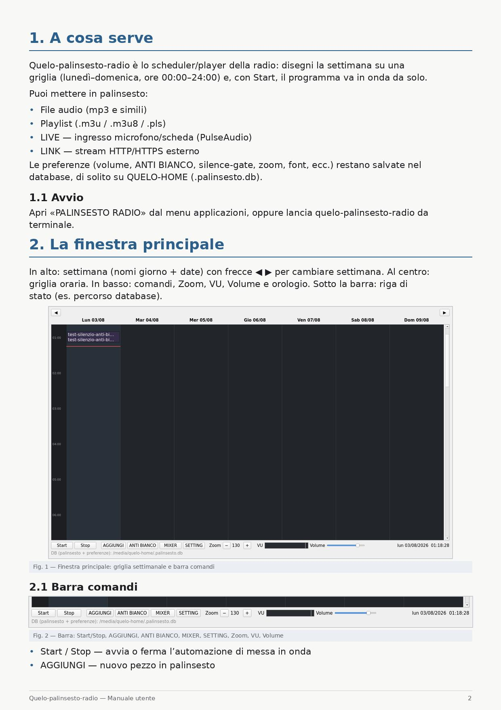
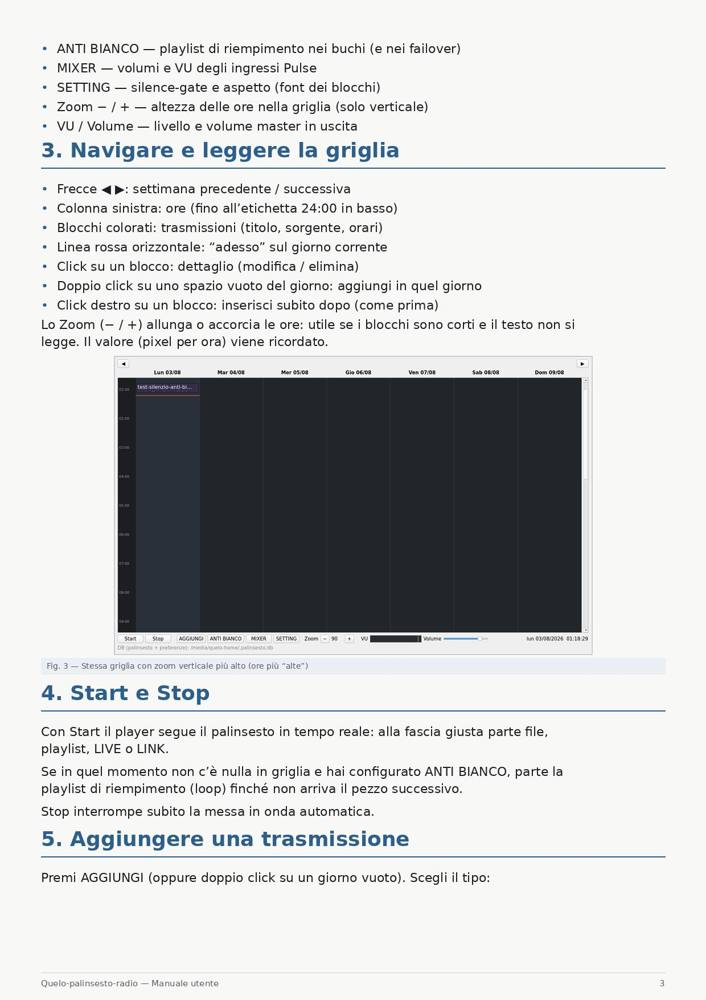
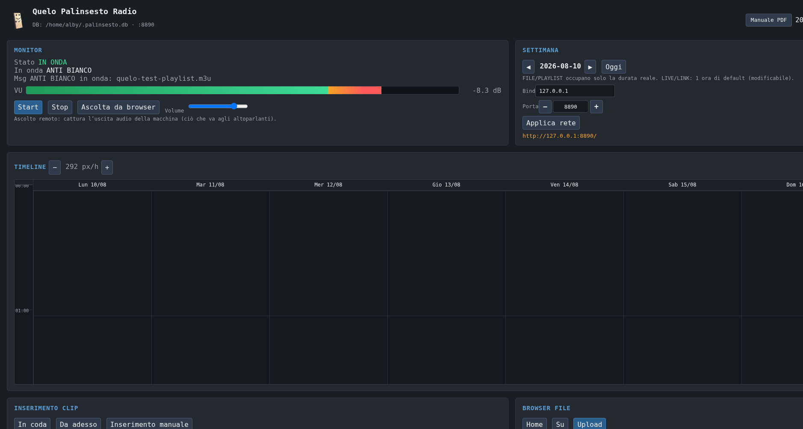
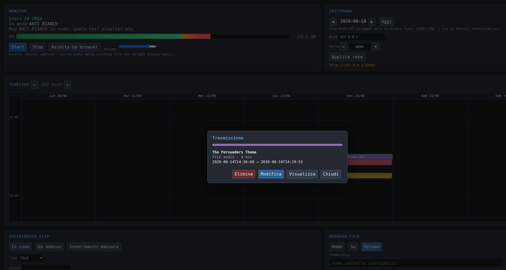
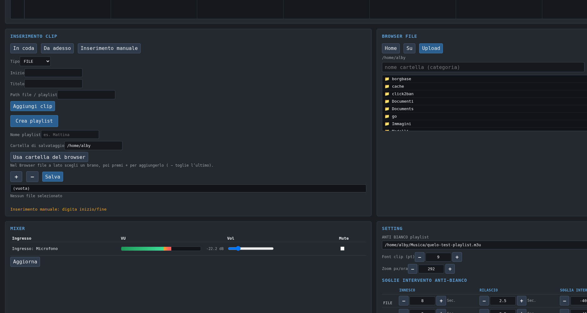

# Quelo Palinsesto Radio

Palinsesto radio automatico per Linux: griglia settimanale, FILE / PLAYLIST / LIVE / LINK, **ANTI BIANCO** (riempimento anti-silenzio), mixer Pulse, interfaccia **desktop (PyQt)** e controllo **via browser** (`--web-only`).


| | |
|---|---|
| **Versione** | vedi file [`VERSION`](VERSION) |
| **Licenza** | (da definire al publish) |
| **Piattaforma** | Linux (Debian e altre distro — vedi dipendenze) |
| **Architetture** | x86_64, aarch64, … se esistono le dipendenze per quella CPU |

---

## Download

Release pacchettizzate (stesso contenuto, tre formati):

| Formato | File |
|--------|------|
| `.tar.gz` | [quelo-palinsesto-radio-\<VERSION\>.tar.gz](dist/) |
| `.zip` | [quelo-palinsesto-radio-\<VERSION\>.zip](dist/) |
| `.rar` | [quelo-palinsesto-radio-\<VERSION\>.rar](dist/) |

Dopo lo scompattamento:

```bash
cd quelo-palinsesto-radio-<VERSION>
chmod +x bin/quelo-palinsesto-radio
./bin/quelo-palinsesto-radio              # GUI desktop
./bin/quelo-palinsesto-radio --web-only   # solo browser
```

Poi apri nel browser (da un altro PC usa l’IP della macchina, non `127.0.0.1`):

```text
http://IP_DEL_COMPUTER_DOVE_È_INSTALLATO:8890/
```

> **Firewall / porta:** di default la porta è **8890**. Usa una porta non bloccata oppure aprila sul firewall della macchina. Dettagli in installazione / README operativo (da completare al publish).

---

## Due modi d’uso

### GUI Desktop

Finestra PyQt: griglia settimanale, Start/Stop, AGGIUNGI, ANTI BIANCO, MIXER, SETTING, linea rossa “adesso”.





Manuale desktop: [`docs/manuale_palinsesto.pdf`](docs/manuale_palinsesto.pdf)

### Usare via web

Stesso motore, interfaccia nel browser (`--web-only`): monitor, timeline, inserimento clip, browser file, upload, mixer, setting.







Manuale web: [`docs/manuale_web.pdf`](docs/manuale_web.pdf)

Pagina progetto (anteprima locale): [`docs/index.html`](docs/index.html)

---

## Dipendenze obbligatorie

Elenco completo con **versioni minime** (anche ciò che “di solito è già installato”, es. Python):

→ **[`tabella_dipendenze_obbligatorie.md`](tabella_dipendenze_obbligatorie.md)**

Nomi pacchetto Debian di riferimento: [`dipendenze.txt`](dipendenze.txt)

Se un comando obbligatorio ha un nome diverso sulla tua distro (es. `pactl`), crea un **symlink** sul `PATH` con il nome atteso — **non** modificare il codice; gli alias di shell non bastano.

---

## Funzioni principali

- Palinsesto settimanale (Lun–Dom, 00:00–24:00)
- Clip **FILE**, **PLAYLIST** (`.m3u` / `.m3u8` / `.pls`), **LIVE** (Pulse), **LINK** (HTTP/HTTPS)
- **ANTI BIANCO** + soglie silence-gate
- MIXER ingressi Pulse (`pactl`)
- Ascolto remoto da browser (uscita della macchina)
- Database SQLite: `/media/quelo-home/.palinsesto.db` oppure `$HOME/.palinsesto.db`

---

## Avvio rapido

```bash
# Desktop
./bin/quelo-palinsesto-radio

# Web (bind di esempio: tutta la LAN)
./bin/quelo-palinsesto-radio --web-only --bind 0.0.0.0 --port 8890
```

Opzioni utili: `--bind`, `--port`, `--web-only`.

**Nota:** non avviare insieme GUI e `--web-only` sullo stesso DB se entrambi devono pilotare l’audio.

---

## Layout sorgente

```text
bin/quelo-palinsesto-radio     launcher
share/quelo-palinsesto-radio/  codice Python
desktop/                       .desktop
docs/                          manuali PDF, assets pagina, screenshot
dist/                          archivi release (.tar.gz / .zip / .rar)
```

---

## Licenza e contributo

Da completare al momento della pubblicazione su GitHub.
